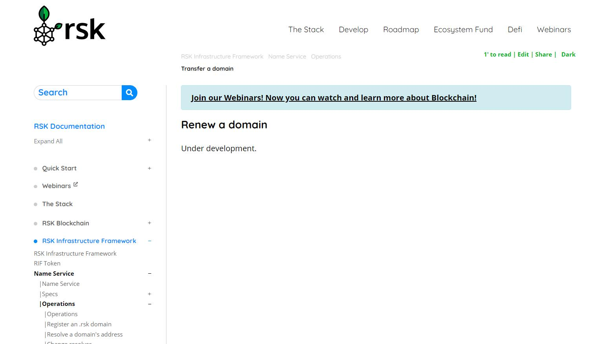

# RNS Test

Currently, some function of operation 

## Get Started
1. `npm install`
1. `npm run resolution`
1. `npm run subdomains`
1. `npm run reverse`

## Registration
### 1.Register an .rsk domain
This operation is not implemented in the rns-js package.


## Resolution
### 1. Resolve a domain address
query domain address
 
```
// The parameter is the registered domain
rns.addr('tinyyxx.rsk').then(console.log);
```

__Result__
```
// Resolved blockchain address
0x0C50Ecd06Dff8C22A9afc80356D5D7F39921e882
```

### 2. Change resolver
Change resolver address

```
// The first parameter domain address, the second parameter resolver address
rns.setResolver('tinyyxx12.rsk', '0x1e7AE43e3503eFB886104ace36051Ea72b301CDf').then(console.log);
```

__Result__
```
{ transactionHash:
   '0x36ab77d46627a943c30f463b98c31751e6db554419665b96c20e8327bf01e60a',
  transactionIndex: 3,
  blockHash:
   '0x432a90f769df77f8c7f3d6a6f92804e89962d690428310a08811d8e7d321be6c',
  blockNumber: 848038,
  cumulativeGasUsed: 200620,
  gasUsed: 28131,
  contractAddress: null,
  from: '0x0c50ecd06dff8c22a9afc80356d5d7f39921e882',
  to: '0x7d284aaac6e925aad802a53c0c69efe3764597b8',
  root: '0x',
  status: false,
  logsBloom:
   '0x00000000000000000000000000000000000000000000000000000000000000000000000000000000000000000000000000000000000000000000000000000000000000000000000000000000000000000000000000000000000000000000000000000000
00000000000000000000000000000000000000000000000000000000000000000000000000000000000000000000000000000000000000000000000000000000000000000000000000000000000000000000000000000000000000000000000000000000000000
0000000000000000000000000000000000000000000000000000000000000000000000000000000000000000000000000000000000',
  events: {} }
```

### 3. Set address resolution
Set a domain resolved address
```$xslt
/**
* @param domain - Domain to set resolution
* @param addr - Address to be set as the resolution of the given domain
*/
rns.setAddr('tinyyxx12.rsk', '0x0000000000000000000000000000000000000001').then(console.log);
```
__Result__
```
{ transactionHash:
   '0x6056cad76e0bd0e4f79647570e0d07eb035219b3f4448150a585367c2c74c4a8',
  transactionIndex: 5,
  blockHash:
   '0x5cc969f466a50f0d33ea2041218a9cc52eacceb242058026f1edd9278cbaf450',
  blockNumber: 848044,
  cumulativeGasUsed: 184276,
  gasUsed: 29126,
  contractAddress: null,
  from: '0x0c50ecd06dff8c22a9afc80356d5d7f39921e882',
  to: '0x1e7ae43e3503efb886104ace36051ea72b301cdf',
  root: '0x',
  status: false,
  logsBloom:
   '0x00000000000000000000000000000000000000000000000000000000000000000000000000000000000000000000000000000000000000000000000000000000000000000000000000000000000000000000000000000000000000000000000000000000
00000000000000000000000000000000000000000000000000000000000000000000000000000000000000000000000000000000000000000000000000000000000000000000000000000000000000000000000000000000000000000000000000000000000000
0000000000000000000000000000000000000000000000000000000000000000000000000000000000000000000000000000000000',
  events: {} }
```

### 4. Set Bitcoin address resolution
Set the bitcoin resolution address corresponding to domain
```
/**
* @param domain - Domain to set resolution
* @param addr - Address to be set as the resolution of the given domain
* @param chainId - Should match one of the listed in SLIP44 (https://github.com/satoshilabs/slips/blob/master/slip-0044.md)
*/
rns.setAddr('tinyyxx12.rsk', '0x0000000000000000000000000000000000000001', '0x80000000').then(console.log);
```
__Result__
```
{ transactionHash:
   '0x8ea5597650ffc70629dfc3882921f06f98c2e74d542d94b568196cfb89c770c2',
  transactionIndex: 10,
  blockHash:
   '0x3f10cc18e9af863e7bf1735740722f5fa8ccab1fb5dc6b9f02494eaab09ba2c3',
  blockNumber: 848066,
  cumulativeGasUsed: 341445,
  gasUsed: 33160,
  contractAddress: null,
  from: '0x0c50ecd06dff8c22a9afc80356d5d7f39921e882',
  to: '0x404308f2a2eec2cdc3cb53d7d295af11c903414e',
  root: '0x',
  status: false,
  logsBloom:
   '0x00000000000000000000000000000000000000000000000000000000000000000000000000000000000000000000000000000000000000000000000000000000000000000000000000000000000000000000000000000000000000000000000000000000
00000000000000000000000000000000000000000000000000000000000000000000000000000000000000000000000000000000000000000000000000000000000000000000000000000000000000000000000000000000000000000000000000000000000000
0000000000000000000000000000000000000000000000000000000000000000000000000000000000000000000000000000000000',
  events: {} }
```


## Ownership admin:
### 1. renew a domain
This operation is not implemented in the rns-js package.

### 2. transfer a domain
There is no implementation of this code in the rns-js package, and under development is displayed in the web page.


## Subdomains
### 1. Register a subdomain
register subdomain
```
/**
* @param domain - Parent .rsk domain. ie: wallet.rsk
* @param label - Subdomain to register. ie: alice
* @param owner - The owner of the new subdomain. If not provided, the address who executes the tx will be the owner
* @param addr - The address to be set as resolution of the new subdomain
*/
rns.subdomains.create('tinyyxx12.rsk', 'rwallet', '0x55d6abcaecf88d438aecf32e38b8ab2466fab737', '0x55d6abcaecf88d438aecf32e38b8ab2466fab737').then(console.log);
```
__Result__
```
Not return anything, it stuck.
```

### 2. Change subdomain’s owner
change subdomain's owner
```
/**
* @param domain - Parent .rsk domain. ie: wallet.rsk
* @param label - Subdomain to register. ie: alice
* @param owner - The owner of the new subdomain
*/
rns.subdomains.setOwner('tinyyxx12.rsk', 'rwallet', '0x55d6AbCaECf88d438AEcF32E38B8aB2466fAb737');
```
__Result__
```
{ transactionHash:
   '0x4467c8636c2e0795e3b326257072255c95b2e352a49f6556c7e1fedba395379b',
  transactionIndex: 3,
  blockHash:
   '0x10e7f99972f0e1d3335b5188559923f4d9de6efdc86d08bdaf0a9d454fd65e56',
  blockNumber: 848170,
  cumulativeGasUsed: 121052,
  gasUsed: 30495,
  contractAddress: null,
  from: '0x0c50ecd06dff8c22a9afc80356d5d7f39921e882',
  to: '0x7d284aaac6e925aad802a53c0c69efe3764597b8',
  root: '0x',
  status: false,
  logsBloom:
   '0x00000000000000000000000000000000000000000000000000000000000000000000000000000000000000000000000000000000000000000000000000000000000000000000000000000000000000000000000000000000000000000000000000000000
00000000000000000000000000000000000000000000000000000000000000000000000000000000000000000000000000000000000000000000000000000000000000000000000000000000000000000000000000000000000000000000000000000000000000
0000000000000000000000000000000000000000000000000000000000000000000000000000000000000000000000000000000000',
  events: {} }
```


## Reverse lookup
### 1. Expose the name of your address
expose the name of my rsk address
```
/**
* @param name - Name to be set as the reverse resolution of the current address
*/
rns.setReverse('rwallet3.rsk').then(console.log);
```
__Result__
```
{ transactionHash:
   '0x4303ef6b89ca5146f22aaa16c63a5634772a9123689d0cc66647c5ba46c3ab77',
  transactionIndex: 6,
  blockHash:
   '0x9b5fa09dc839f517acf795530c5db0ff41bce28673a80bc60b0a2f96a1c694bc',
  blockNumber: 848174,
  cumulativeGasUsed: 247278,
  gasUsed: 64389,
  contractAddress: null,
  from: '0x0c50ecd06dff8c22a9afc80356d5d7f39921e882',
  to: '0xc1cb803d5169e0a9894bf0f8dcdf83090999842a',
  root: '0x01',
  status: true,
  logsBloom:
   '0x00000000000000000000000000000000000000000000000001000000000000008000800000000000000000000000000000000000020010000000000000028000000000000000000048000000000000000000000000000000000000000001000000000008
00000000000000000000000000000000000000800000000000000000000000000000000000000000000000040000000000000004001000000000000000000000000000000000000000000000000400000000000000800004000000000000000000000000004000
0000005000000000000000000000000000000000000000000000000000000000000000000000000080001002000000000000000000',
  events:
   { '0':
      { logIndex: 0,
        blockNumber: 848174,
        blockHash:
         '0x9b5fa09dc839f517acf795530c5db0ff41bce28673a80bc60b0a2f96a1c694bc',
        transactionHash:
         '0x4303ef6b89ca5146f22aaa16c63a5634772a9123689d0cc66647c5ba46c3ab77',
        transactionIndex: 6,
        address: '0x7d284aaAc6e925AAd802A53c0c69EFE3764597B8',
        id: 'log_611a5c87',
        returnValues: Result {},
        event: undefined,
        signature: null,
        raw: [Object] },
     '1':
      { logIndex: 1,
        blockNumber: 848174,
        blockHash:
         '0x9b5fa09dc839f517acf795530c5db0ff41bce28673a80bc60b0a2f96a1c694bc',
        transactionHash:
         '0x4303ef6b89ca5146f22aaa16c63a5634772a9123689d0cc66647c5ba46c3ab77',
        transactionIndex: 6,
        address: '0x7d284aaAc6e925AAd802A53c0c69EFE3764597B8',
        id: 'log_c7f9cba2',
        returnValues: Result {},
        event: undefined,
        signature: null,
        raw: [Object] },
     '2':
      { logIndex: 2,
        blockNumber: 848174,
        blockHash:
         '0x9b5fa09dc839f517acf795530c5db0ff41bce28673a80bc60b0a2f96a1c694bc',
        transactionHash:
         '0x4303ef6b89ca5146f22aaa16c63a5634772a9123689d0cc66647c5ba46c3ab77',
        transactionIndex: 6,
        address: '0x8587385ad60038bB181aFfDF687c4D1B80C4787e',
        id: 'log_6c2d4025',
        returnValues: Result {},
        event: undefined,
        signature: null,
        raw: [Object] } } }
```
### 2. Find the name of an address
Pass in the blockchain address to get the domain name of the address
```
/**
* @param address - address to be resolved
*/
rns.reverse('0x55d6AbCaECf88d438AEcF32E38B8aB2466fAb737').then(console.log);
```
__Result__
```
// successfully find the name we set above for this address
rwallet3.rsk
```

## Register with auction model?:
### 1. Migrate a domain from auction registration
This rns package is not implemented, but this should be done on the rnsManager website.
